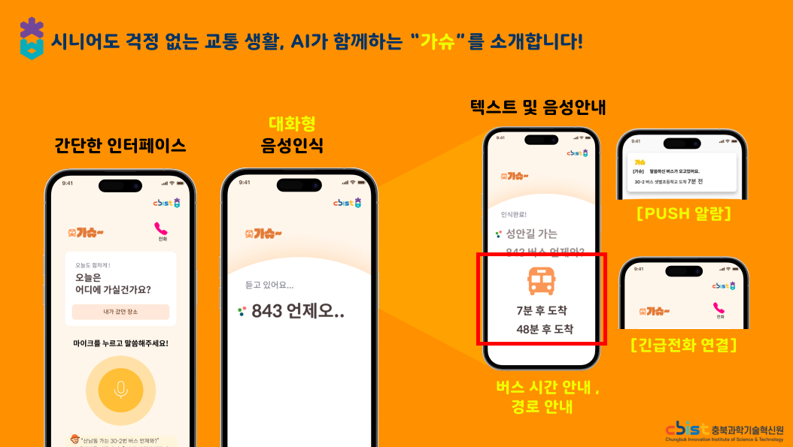
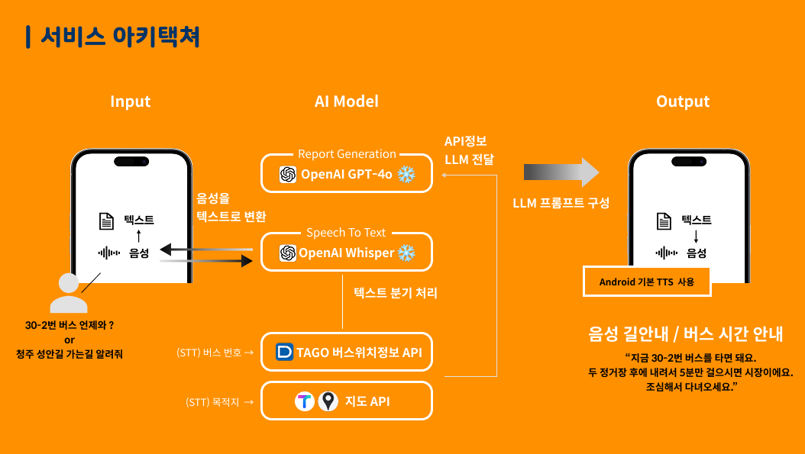
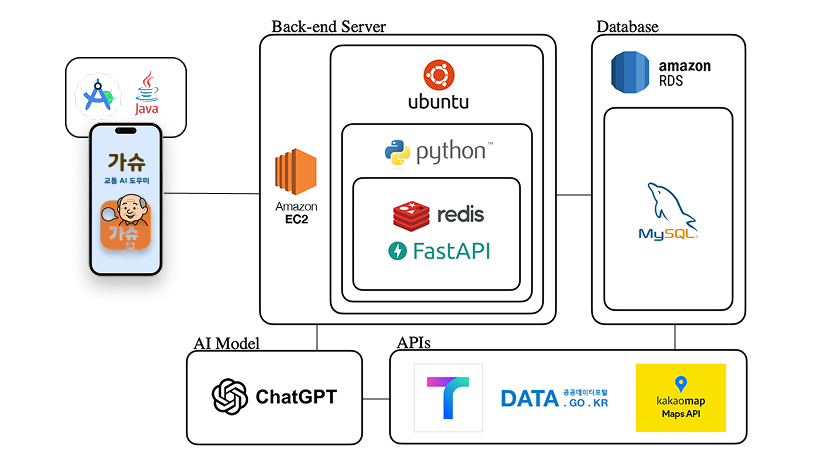
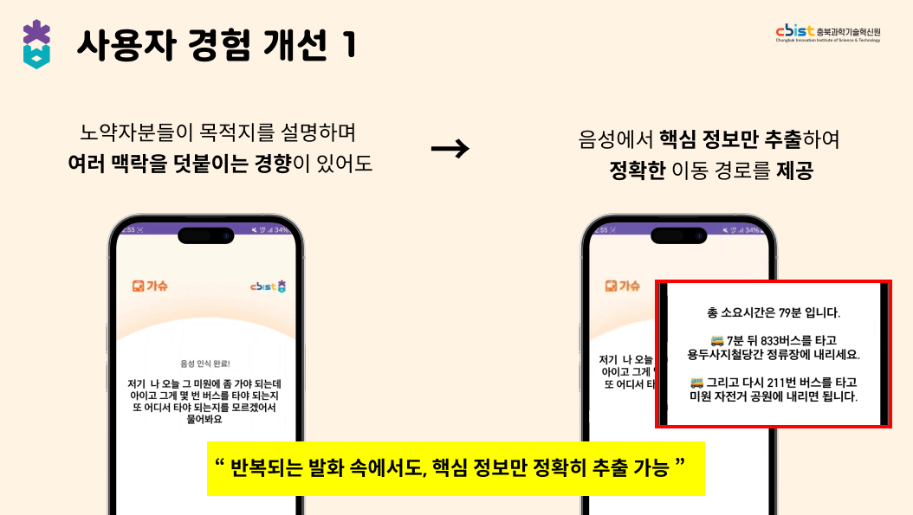
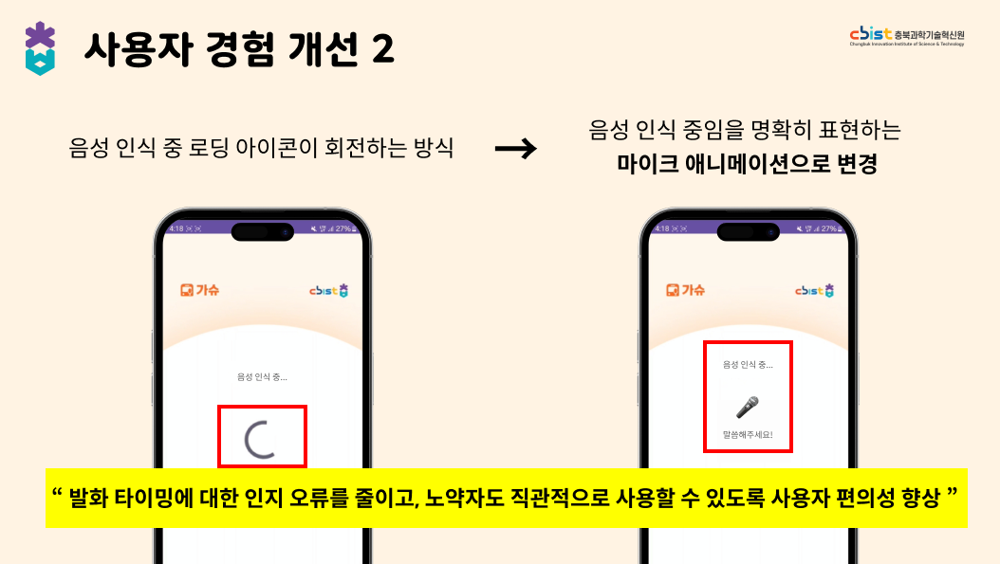
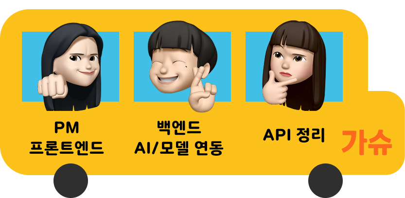

# 🚌 가슈 - 말로 이동하는 노약자 전용 AI교통 도우미 프론트 레포

### 🏆 2025 충북 해커톤 **최우수상 수상**
> 말 한마디로 목적지 설정과 버스 도착 정보 안내까지!
> 
> 고령자와 교통 약자를 위한 AI 음성 기반 이동 정보 서비스

---
## 🔗 프로젝트 링크
📒 [팀 노션](https://www.notion.so/1f1800c9877b8000a4e9fc894388a939?source=copy_link)

---

## 📝 프로젝트 소개
 **가슈(GASHU)** 는 음성 명령 기반으로 고령자와 교통 약자가  
버스를 쉽고 안전하게 이용할 수 있도록 도와주는  
AI 기반 교통 도우미 서비스입니다.

사용자가 말로 목적지를 말하면, 음성 데이터를 **STT(Speech-to-Text)** 로 변환하고, 
이를 **LLM 기반 자연어 처리 모델**이 분석하여 도착지 인식, 경로 추천, 버스 남은 시간 안내까지 수행합니다. 
이후 시스템 응답은 **TTS(Text-to-Speech)** 를 통해 음성으로 제공되어 
모든 과정을 음성으로 완결 할 수 있습니다. 
>
>**화면 최소화 + 음성 중심 인터랙션**으로 접근성을 높였습니다.

---

## 📱 주요 기능

| 기능 | 설명 |
|------|------|
| 🎙️ 음성 인식 | 고령자가 앱을 터치하지 않고 말로 명령 가능 |
| 🧭 교통 안내 | 현재 위치 기반 교통편 추천 및 도착 시간 안내 |
| 📞 긴급 전화 연결 | 등록한 번호로 긴급 상황시 바로 연결 제공 |
| 🗣️ 음성 피드백 | 시스템 응답도 음성과 텍스트로 안내 |
| 👴 쉬운 UI | 고령자를 위한 큰 글씨 & 단순 동선 구성 |
 
---

## 👷🏾 서비스 아키텍쳐

## 🚧 시스템 아키텍쳐

---

## 🧪 사용자 경험 개선 & 트러블슈팅

  
  

- **음성 명령 인식 실패율 개선**
  - 초기에 사투리, 반복어, 고령자의 불명확한 발음 등으로 인식 실패율이 높았음  
  - 해결: **세분화된 프롬프팅 설계**로 명령 예측 정확도 향상
 
- **UI 혼란**
  - 음성 인식 중 로딩 상태에서 화면 피드백 부족으로 인해  
    노약자 사용자가 진행 상태를 인지하지 못하는 문제 발생  
  - 해결: **로딩 인디케이터를 마이크 애니메이션으로 교체** 하여  
    현재 상태를 직관적으로 알 수 있게 개선

---
    
## 😼 구성원 소개  

